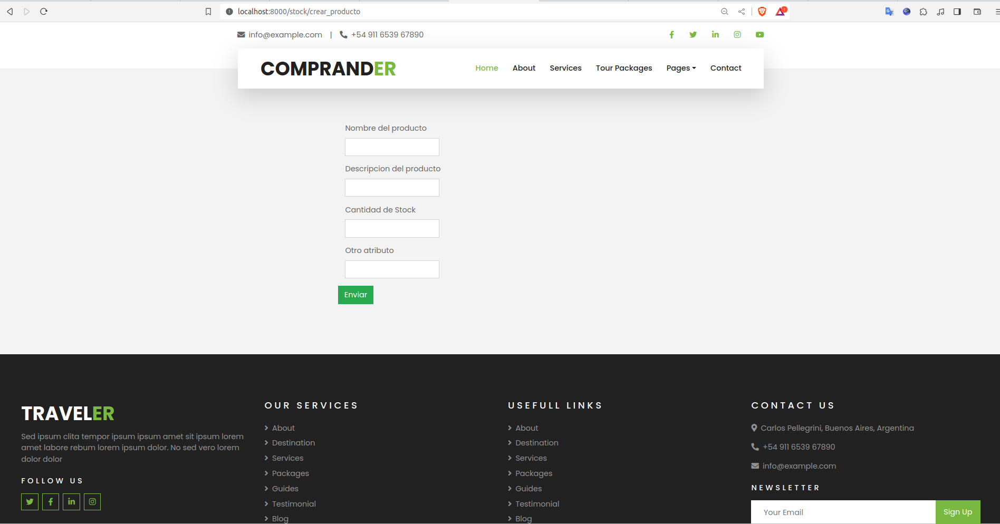

# PROYECTO EN DJANGO
#### Install entorno virtual para elproyecto django
```
$ pip install virtualenv
```
#### Crear el entorno vitual
```
$ virtualenv venv
```
#### Creación de directorio
```
$ ll

venv
README.md
```
#### Activar el entorno
```
$ source venv/bin/activate
```
### Instalar Django
```
$ pip install django
```
#### verificar si esta instalado correctamente
```
$ django-admin --version
```
o
```
$ python -m django --version
```
### Crear el proyecto 
```
$ django-admin startproject django_coder 
```
Si necesitamos colocar los archivos en el mismo directorio para que no cree un directorio raíz, utilizar el siguiente comando.

if we need colocate the archives in the same directory for the not existing in the directory base, use the following command:

$ django-admin startproject django_coder .

#### Levantando el proyecto
```
$ python manage.py runserver 
```

To use a port other than 8000, you can ejecution whit the command line: 
```
$ python manage.py runserver 3000
```
### Iniciar una aplicacion

```
$ python manage.py startapp carritoapp
```

We create a directory whit the name carritoapp, whit the following archives
```
admin.py
apps.py
__init__.py
migrations
models.py
tests.py
views.py
```

### Crear user admin
```
python manage.py createsuperuser
Username (leave blank to use 'gburgos'): admin
Email address: asdf@asdf.com
Password: 
Password (again): 
The password is too similar to the username.
This password is too short. It must contain at least 8 characters.
This password is too common.
Bypass password validation and create user anyway? [y/N]: y
Superuser created successfully.
```
### Primeros pasos de creación de la aplicación.

####MODELS

Trabajaremos con el archivo models.py

base del archivo:

```
from django.db import models
# Create your models here.
```

### Se crea la clase para el modelado de la clase
```
from django.db import models

# Create your models here.

#Creamos una clase

class producto(models.Model):
    nombre = models.CharField(max_length=30)
    categoria = models.CharField(max_length=30)
    precio = models.IntegerField()
    #Definimos la salida para ver de forma sencilla
    def __str__(self):
        return f'{self.nombre} -> {self.precio}'
```

#### VIEWS
```
Base del archivo original

from django.shortcuts import render

# Create your views here
```
Modificando el archivo original
```
from django.shortcuts import render, HttpResponse

# Create your views here.
#Primera vista
def tienda(request):
    return HttpResponse("Hola Mundo!!!")
    #return render(request, "tienda.html")
```

Probamos nnuestra aplicacion, ejecutamos la linea de comando:

python manage.py runserver

Como respuesta nos indica que tenemos 18 migraciones a aplicar
```
Watching for file changes with StatReloader
Performing system checks...

System check identified no issues (0 silenced).

You have 18 unapplied migration(s). Your project may not work properly until you apply the migrations for app(s): admin, auth, contenttypes, sessions.
Run 'python manage.py migrate' to apply them.
December 03, 2023 - 14:08:27
Django version 4.2.7, using settings 'carrito.settings'
Starting development server at http://127.0.0.1:8000/
Quit the server with CONTROL-C.
```

Antes de avanzar debemos dirigirnos al archivo del directorio raíz carrito a urls.py y añadir nuestra aplicación
```
from django.contrib import admin
from django.urls import path

#importamos nuestra aplicacion carrito
from carritoapp.views import tienda

urlpatterns = [
    path('admin/', admin.site.urls),
    path('', tienda, name="Tienda")
]
```
Cargamos la aplicacion en el navegador


A continuacion vamos a crear la migración con la linea de comando
```
$ python manage.py makemigrations
```
luego la linea de comando
```
$ python manage.py migrate 
```
Con el resultado: 
```
Operations to perform:
  Apply all migrations: admin, auth, contenttypes, sessions
Running migrations:
  Applying contenttypes.0001_initial... OK
  Applying auth.0001_initial... OK
  Applying admin.0001_initial... OK
  Applying admin.0002_logentry_remove_auto_add... OK
  Applying admin.0003_logentry_add_action_flag_choices... OK
  Applying contenttypes.0002_remove_content_type_name... OK
  Applying auth.0002_alter_permission_name_max_length... OK
  Applying auth.0003_alter_user_email_max_length... OK
  Applying auth.0004_alter_user_username_opts... OK
  Applying auth.0005_alter_user_last_login_null... OK
  Applying auth.0006_require_contenttypes_0002... OK
  Applying auth.0007_alter_validators_add_error_messages... OK
  Applying auth.0008_alter_user_username_max_length... OK
  Applying auth.0009_alter_user_last_name_max_length... OK
  Applying auth.0010_alter_group_name_max_length... OK
  Applying auth.0011_update_proxy_permissions... OK
  Applying auth.0012_alter_user_first_name_max_length... OK
  Applying sessions.0001_initial... OK
  ```

En settins.py (archivo ubicado en la ruta origen) registramos nuestra aplicacion
```
  # Application definition

INSTALLED_APPS = [
    'django.contrib.admin',
    'django.contrib.auth',
    'django.contrib.contenttypes',
    'django.contrib.sessions',
    'django.contrib.messages',
    'django.contrib.staticfiles',
    #Vamos a registrar nuestra aplicacion carritoapp
    'carritoapp',
]
```
Volvemos a views.py para cambiar nuestra prueba de **Hola Mundo!!**

Creamos un directorio llamado templates para la ubicación de nuestros archivos html, se crea unddirectorio llamado static en carrito, y copiamos de nuestro ejemplo los directorios para que cargue nuestro base.html 

al principo del html cargar
```

```
en los links para las llamadas de css o js
```
{% static %'} y finalizar con {' %}
```
Ejemplo
```
<link href="" rel="stylesheet">
<script src=""></script>
```
En el DIrectorio Raiz carrito en setting.py añadir 
```
STATICFILES_DIR = [BASE_DIR / 'static']
```
Resultado final
```
# Static files (CSS, JavaScript, Images)
# https://docs.djangoproject.com/en/4.2/howto/static-files/

STATIC_URL = 'static/'
STATICFILES_DIR = [BASE_DIR / 'static']
```

Crear un archivo index.html

Para utilizar herencia de contenido en el archiv base.html entre el navbar y footer declar lo siguiente.
```


```

### Ingreso a crear_producto


```
Ruta:

http://localhost:8000/stock/crear_producto
```

### Ingreso a crear_insumo

```
Ruta:

http://localhost:8000/stock/crear_producto

```

